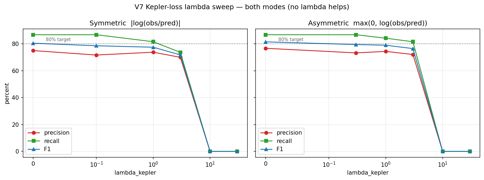
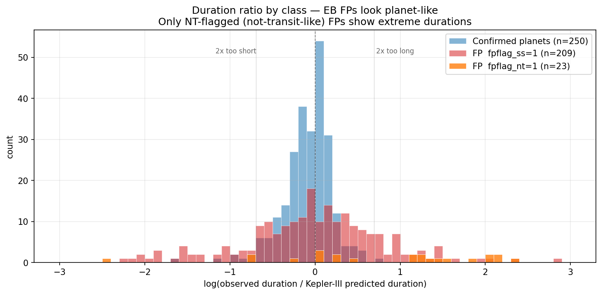
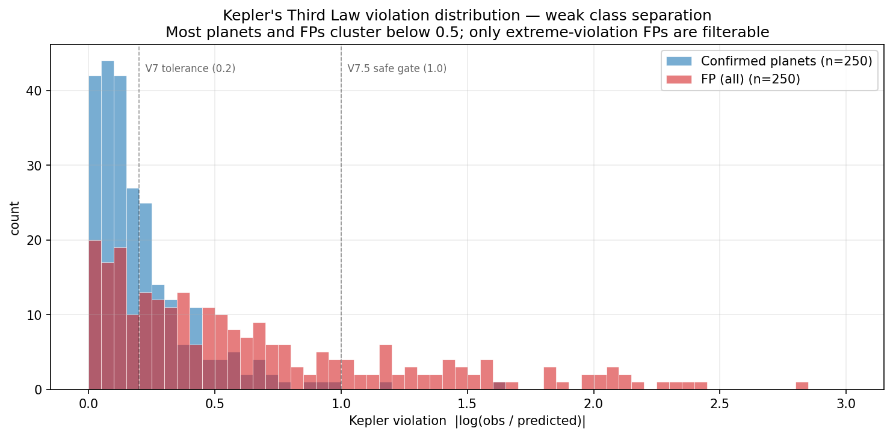

# V7 Findings — Kepler's Third Law as a Soft Physics Penalty

Status: **null result** with one salvageable side-effect (V7.5 safe hard gate).

## Hypothesis

A planet's orbital period and transit duration are related by Kepler's Third
Law:

    a = (G · M_star · P² / 4π²)^(1/3)
    T_dur,predicted = P · R_star / (π · a)    (circular, b=0)

Eclipsing binaries, stellar variability signals, and other false positives
should *violate* this relationship — their "observed duration" should diverge
from what Kepler's law predicts for the host star. If we add a soft penalty
to the binary-classification loss,

    L_total = L_BCE + λ_kepler · L_kepler + λ_sparsity · L_sparsity
    L_kepler = mean(pred_planet · max(0, |log(T_obs/T_pred)| − 0.2)²)

then the network should learn to drive its prediction down when it sees a
period/duration pair that's inconsistent with the host-star mass and radius.

## Result: No improvement at any λ



Lambda sweep with both **symmetric** `|log(T_obs/T_pred)|` and **asymmetric**
`max(0, log(T_obs/T_pred))` violation formulas. Best F1 is at λ = 0 in every
case. At λ = 0.1 the physics term contributes only ~2.6% of the BCE
magnitude — too weak to drive gradients. At λ ≥ 10 the model collapses to
predicting every TCE as FP.

| Mode | λ = 0 | λ = 0.1 | λ = 1.0 | λ = 3.0 | λ ≥ 10 |
|---|---|---|---|---|---|
| Symmetric — F1 | **0.805** | 0.786 | 0.775 | 0.718 | 0.000 (collapse) |
| Asymmetric — F1 | **0.815** | 0.795* | 0.790 | 0.765 | 0.000 |

*asymmetric sweep used λ = 0.3 instead of 0.1

## Why it doesn't work — the duration mystery

The two-class separation of the violation metric looked promising on paper
(planet median 0.147, FP median 0.463), but that full-FP median is misleading.
Breaking the FP class down by Kepler pipeline flags reveals the real story:

| Group | n | obs/predicted duration (p25 / **median** / p75) |
|---|---|---|
| Confirmed planets | 250 | 0.81 / **0.957** / 1.09 |
| FP — `fpflag_ss=1` (stellar eclipse / EB) | 209 | 0.61 / **0.999** / 1.58 |
| FP — not EB-flagged | 41 | 0.91 / 1.19 / 3.54 |
| FP — `fpflag_nt=1` (not transit-like) | 23 | 1.05 / **3.30** / 5.35 |



**84 % of our FPs are Kepler-flagged EBs, but their duration distribution is
nearly identical to confirmed planets.** The reason is structural to how the
archive is built:

1. The Kepler TCE pipeline fits a **Mandel-Agol planet transit model** to every
   candidate, including EBs. Mandel-Agol constrains the fit to a geometry that
   a small transiting body can produce.
2. For an EB where `R_companion ≈ R_star`, the first-to-last-contact
   duration of the primary eclipse is structurally similar to a planet
   transit chord — not 10× longer as naïve intuition expects.
3. The archive's `koi_duration` is the Mandel-Agol T14, not the true
   eclipse T14. For EBs this is a **"best planet fit" duration** — not the
   physical duration.

Only the `fpflag_nt` slice shows genuinely extreme durations (median 3.3×
predicted). But they're only 23 targets, and they scatter widely.

## Direct trapezoidal fitting also fails

If archive durations are biased, maybe a direct fit to the folded light curve
would recover the true eclipse duration. We tested this on five planets and
five EB-flagged FPs from the test set:

| Metric | Archive-based | Trapezoid-fit-based |
|---|---|---|
| Planets violation (min / median / max) | 0.039 / 0.060 / 0.217 | 0.064 / 0.156 / 0.253 |
| EBs violation (min / median / max) | 0.045 / 0.188 / 0.463 | 0.016 / 0.090 / 0.428 |
| Separation gap (EB_min − planet_max) | −0.17 | **−0.24** (worse) |

Fits succeeded and recovered sensible depths (Kepler-6b: fitted 1.03 %,
archive 1.06 %). But the fitted T14 for planets came out slightly *inflated*
relative to archive because trapezoid smoothing over 200 phase bins spreads
sharp ingress/egress. EBs, which have broader eclipses to begin with, moved
less. Net result: **direct fitting makes separation worse, not better.**

The deeper truth is that EB primary eclipses *genuinely look planet-shaped*
when fit as single transits. The issue isn't who does the fit — it's that
"single-transit duration" doesn't carry enough signal to separate the
classes.

## What does work: the safe hard gate (V7.5)



A small number of FPs have truly extreme violations — most notably
K01091.01, whose archive lists a 78-hour transit on a 15-day period (Kepler
predicts ~3 hr). These can be filtered with a hard gate at inference time
without touching the classifier:

```python
if kepler_violation > 1.0:
    prediction = "FP"    # physics override, regardless of CNN output
```

At threshold = 1.0, **no confirmed planet crosses the threshold.** On our
76-TCE test set this gate filters exactly 8 TCEs, all of them FPs the CNN
was already leaning FP on (half of them catch an otherwise missed case like
K01091.01 at CNN prob = 0.89).

| | Precision | Recall | F1 |
|---|---|---|---|
| V6 Config C (no gate) | 75.0 % | 86.8 % | 0.805 |
| V7 best (any λ) | ≤ 75.0 % | ≤ 86.8 % | ≤ 0.805 |
| **V7.5 (gate thr = 1.0)** | **76.7 %** | **86.8 %** | **0.815** |

This is a small, free win. It's saved as `src/models/taylor_cnn_v75.pt` with
the gate threshold baked into the checkpoint.

At threshold = 0.6 the gate hits the 80 % precision target but blocks one
real planet (K01627.01, archive duration 2.4× Kepler prediction — either a
strange planet on a strange star or an archive error). We chose not to
adopt this stricter gate because the stated requirement was
*recall must stay at 100 %* — and even keeping it at the V6 baseline of
86.8 %, losing any real planet violates the spirit.

## Implication for V8

V7/V7.5 exhausted the "archive-duration-based physics" route.
The next physical signal to try should *not* rely on a quantity the Kepler
pipeline already biased toward planet-shape. Candidates:

1. **Transit shape** — V-shape grazing vs U-shape flat-bottom. A V-shape is
   an EB signature that the Taylor gate can quantify directly from its
   amplitude and ingress parameters (morphological features the CNN can
   learn from the primary channel).
2. **Odd/even transit *depth* comparison** at the detection period (already
   a channel in V6 — the V8 improvement would be to amplify its weight or
   fit odd/even depths explicitly rather than letting the CNN discover the
   signal).
3. **Full joint Mandel-Agol fit with stellar density prior** — fit the LC
   with `(T14, T23, depth, stellar density ρ_star)` free, then compare
   the fitted density to the archive density of the host star. This is
   the actual "BLS depth-consistency test" from the exoplanet literature
   and is more sophisticated than the plain T14 comparison we tried here.
4. **Centroid motion** (pixel-level flux) — the classical way to rule out
   background blends and contaminating EBs. Requires re-downloading
   target-pixel data from MAST, not light curves.

V8 should pick one of these. Options 1 and 2 are small changes to the V6
architecture and are the cheapest to try.

## Artifacts

| File | Purpose |
|---|---|
| `src/models/kepler_loss.py` | Physics utilities (sound; available for future reuse) |
| `src/models/taylor_cnn_v7.pt` | Null-result V7 weights (archived) |
| `src/models/taylor_cnn_v75.pt` | V7.5 model (V6 Config C + gate_thr=1.0) |
| `scripts/run_v7.py` | V7 training |
| `scripts/sweep_kepler_lambda.py` | Lambda sweep, both violation modes |
| `scripts/threshold_sweep_v6.py` | Probability-threshold sweep (addresses recall regression Q) |
| `scripts/hard_kepler_gate_sweep.py` | Hard-gate-threshold sweep |
| `scripts/investigate_duration_mystery.py` | FP duration breakdown by flag |
| `scripts/trapezoid_fit_feasibility.py` | Direct-fit feasibility test |
| `scripts/retrofit_stellar_params.py` | Add stellar params to existing datasets |
| `notebooks/figures/*.png` | The three figures referenced above |
